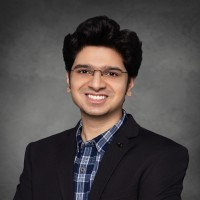

The NIH workshop on **The Evolving Cyberinfrastructure at the National Institutes of Health to Support Data and AI in Biomedical Research**, at the Pacific Symposium on Biocomputing (PSB) 2026, led by Ojas A. Ramwala, Nick Weber, and Sean D. Mooney, brings together experts in computational biology and biomedical research to discuss innovative approaches and foster collaboration.

The rapidly transforming landscape of acquiring, sharing, and processing data has fueled the burgeoning volume of biomedical and clinical data. It is imperative to support biomedical computing investigators in utilizing this wealth of biologically meaningful information. Advancements in AI techniques, in conjunction with improved capabilities in implementing large-scale data processing pipelines, have led to the development of robust computational methods and algorithms to solve complex biological problems. However, there are many challenges associated with providing researchers with secured systems for accessing biological data and computational resources that must be addressed. The NIH has established a novel set of tools that provides for secured biomedical data sharing mechanisms, affordable access to cloud services, and secure data analytics workspaces to enable the biomedical research community to achieve the potential of the emergent data and AI ecosystem. This workshop aims to showcase the major challenges impeding researchers’ access to biomedical datasets and computing infrastructures and will cover the key components of the NIH’s cyberinfrastructure developed to advance data science and AI research for biomedical applications.

## Conference Context

The Pactific Symposium on Biocomputing is an annual conference held in Hawaii, USA, focusing on the intersection of computation and biology. For more details, visit [psb.stanford.edu](https://psb.stanford.edu).

## Workshop Organizers

|  |  |  |
|:---:|:---:|:---:|
| **Ojas A. Ramwala, PhD** Scientist I School of Medicine and Public Health University of Wisconsin–Madison | **Nick Weber** Acting Director Office of Scientific Computing Services Center for Information Technology (CIT) National Institutes of Health | **Sean D. Mooney, PhD** Director Center for Information Technology (CIT) National Institutes of Health (NIH) |

## Workshop Focus

- Advanced cyberinfrastructure for biomedical research
- Cutting-edge computational methods
- Artificial intelligence in biomedicine
- Collaborative approaches to managing, storing, sharing, and analyzing biomedical data
- Solutions to current challenges in the field

## Workshop Schedule
The workshop will feature keynote speakers, panel discussions, and interactive sessions. Attendees will have the opportunity to engage with experts, share their research, and explore new tools and technologies.

| Speaker | Time, Name, Affiliation, Talk Title | Biography |
|--------------|-------------------------------------|-----------|
|  | **1:00 PM - 1:20 PM** **Sean D. Mooney, PhD** National Institutes of Health  *Building the tools to support the biomedical research digital ecosystem* | Dr. Sean Mooney serves as the Director of the NIH Center for Information Technology and the NIH Associate Director for Information Technology, Cyberinfrastructure and Cybersecurity (AD ITCC).  He oversees an approximately $400 million portfolio that includes a world-renowned supercomputer, a state-of-the-art network, cloud-based services, and the latest collaboration tools. |
|  | **1:20 PM – 1:40 PM** **Li Shen, PhD, FAIMBE, FACMI, FAMIA** University of Pennsylvania  *Advancing Dementia Research with AI and Informatics: Mining Multidimensional Biobank DataBiomedical Data Science* | Dr. Li Shen is Professor of Informatics and Radiology at the Perelman School of Medicine, University of Pennsylvania, where he serves as Associate Director for Bioinformatics at the Institute for Biomedical Informatics and Co-Director of the Penn Center for AI and Data Science for Integrated Diagnostics. |
|  | **1:40 PM – 2:00 PM** **Sarah Biber, PhD** Washington University in St. Louis  *From a server in a closet to an AI-ready discovery engine: Key lessons from the NACC Data Platform transformation* | Dr. Sarah Biber is an interdisciplinary researcher whose work integrates data science, bioinformatics, human-centered systems engineering, and implementation science. She serves as mPI of The Consortium for Clarity in ADRD Research Through Imaging (CLARiTI), a multi-institutional study leveraging imaging, blood-based biomarkers, and digital neuropathology to investigate and disentangle mixed dementia. |
|  | **2:00 PM – 2:20 PM** **Nick Weber, MS, MBA** National Insitutes of Health  *From Infrastructure to Insight: Enabling the Next Generation of Biomedical Science* | Nick Weber is the Acting Director of the Office of Scientific Computing Services at the NIH Center for Information Technology (CIT). He has been supporting cloud computing, high-performance computing, and other scientific infrastructure activities to enable research within the NIH for 17 years. For the past few years, he has been focused on the NIH Science and Technology Research Infrastructure for Discovery, Experimentation, and Sustainability (STRIDES) Initiative. |
|  | **2:20 PM – 2:40 PM** **BREAK** |  |
|  | **2:40 PM – 3:00 PM** **Timothy J. Hohman, PhD** Vanderbilt University  *Building Harmonized Data Resources to Facilitate AI Applications in Neurodegenerative Disease* | Dr. Timothy Hohman is a Professor of Neurology, cognitive neuroscientist, and computational geneticist, with secondary appointments in the Vanderbilt Genetics Institute and Department of Pharmacology. Dr. Hohman's research leverages advanced computational approaches from genomics, proteomics, and neuroscience to identify novel markers of Alzheimer's disease risk and resilience. |
|  | **3:00 PM – 3:20 PM** **Steven Brenner, PhD** UC Berkeley  *TBD* | Dr. Steven Brenner leads a research lab that has three key research interests involving computational and experimental genomics: (1) Gene regulation by alternative splicing and nonsense-mediated mRNA decay; (2) Prediction of protein function using Bayesian phylogenomics; (3) Personal genomics.|
|  | **3:40 PM – 4:00 PM** **Ryan Whaley** Stanford University  *ClinPGx: Integration of pharmacogenomics into genomic medicine* | Ryan Whaley is a co-technical lead of ClinPGx. He is a software developer at Stanford University who focuses on building web applications and designing databases. Ryan has been in Dr. Teri Klein's lab working with pharmacogenomic (PGx) data since 2007. He builds tools for PGx curation and designs user interfaces for researchers, clinicians, and the public to find and understand pharmacogenomic knowledge.|
|  | **3:40 PM – 4:00 PM** **Jason H. Moore, PhD, FACMI, FIAHSI, FASA** Cedars-Sinai Medical Center  *Ten Tips for Effective AI Analysis of Biomedical Data* | Dr. Moore completed a Ph.D. in Human Genetics and an M.A. in Statistics at the University of Michigan in 1999. He joined Cedars-Sinai Medical Center in 2021 as the founding Chair of the Department of Computational Biomedicine and Director of the Center for Artificial Intelligence Research and Education.|
|  | **4:00 PM – 4:30 PM** **Panel Discussion** |  |

---
